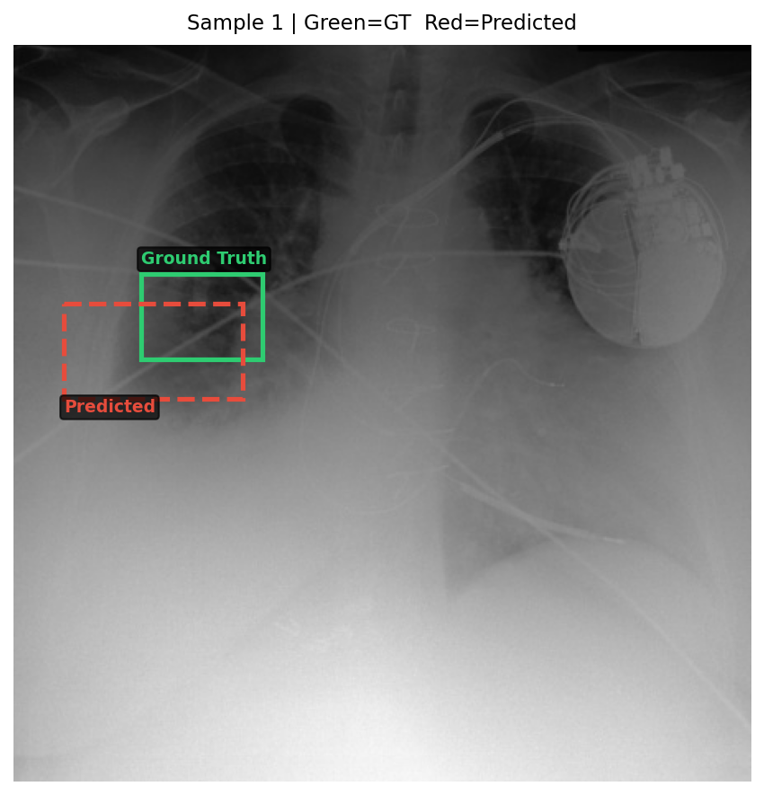
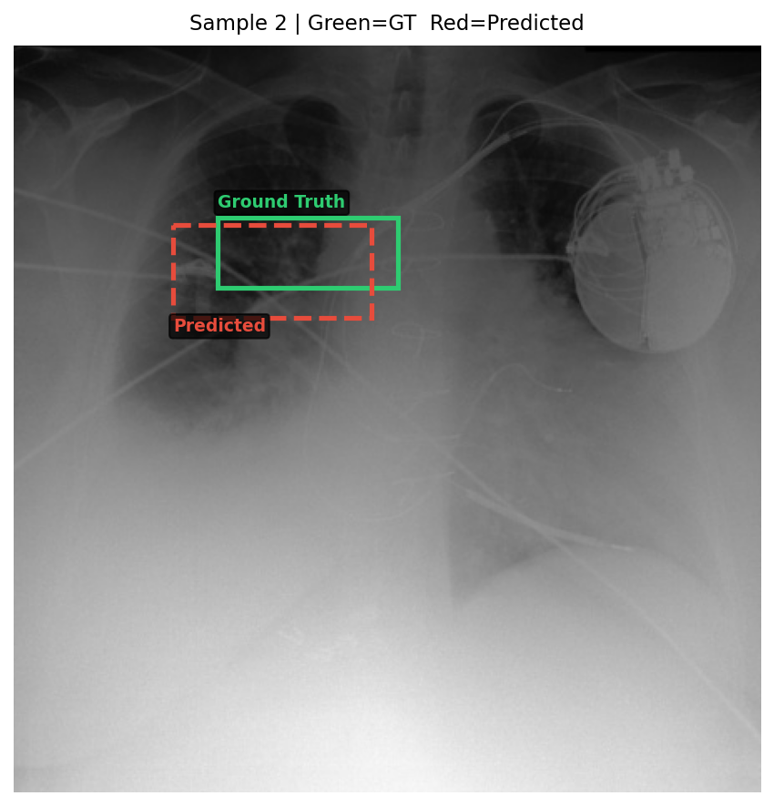
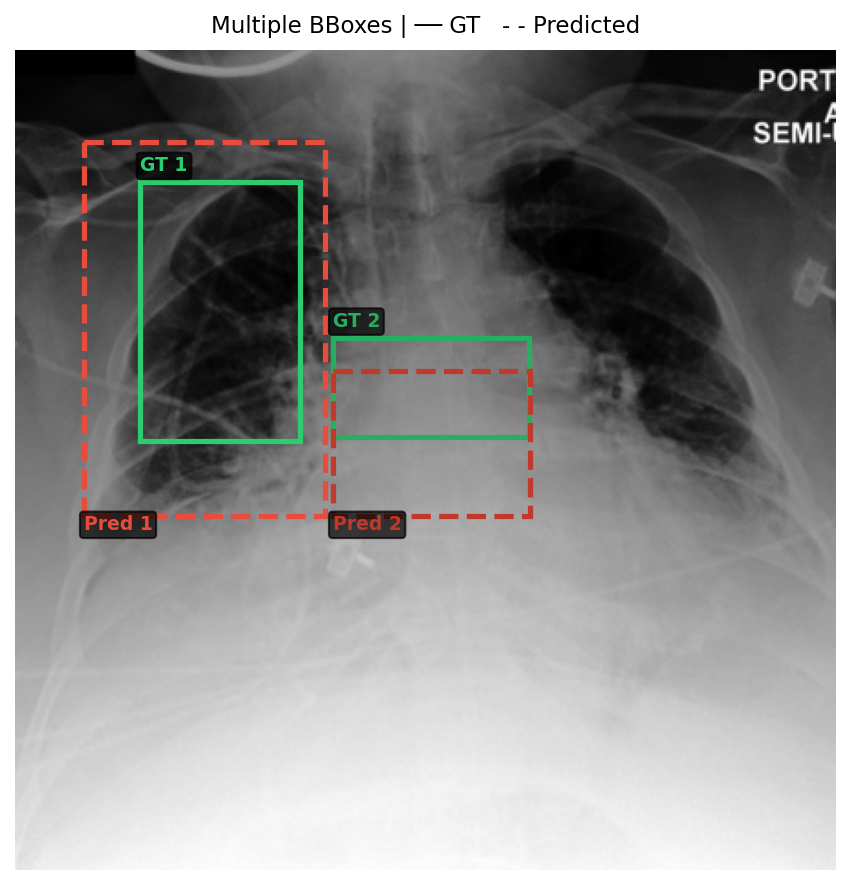

# Insight-CXR

**Capstone Project — Ongoing**

Insight-CXR is a multimodal AI project focused on chest X-ray understanding. The goal is to answer clinical questions about a chest X-ray while also identifying the relevant region in the image using bounding boxes.

For example, the model takes a chest X-ray and a question as input and produces a textual response along with the coordinates of the relevant region.

---

## What the project does

The model takes:

```text
Chest X-ray image + Clinical question
```

and generates:

```text
Clinical answer + Bounding box coordinates
```

The project is built using **Qwen2.5-VL-3B**, which is a Vision-Language Model. Instead of training the complete model from scratch, I used **LoRA with PEFT** to fine-tune it for this task. The model was loaded using Hugging Face Transformers and 4-bit quantization was used to reduce memory requirements during inference.

The predicted bounding boxes are generated in the following format:

```text
<box>[x1, y1, x2, y2]</box>
```

These coordinates are then used to locate the relevant region in the chest X-ray.

---

## How it works

The overall workflow is:

```text
Chest X-ray + Question
        ↓
Fine-tuned Qwen2.5-VL-3B
        ↓
Clinical Response + Bounding Box
        ↓
Compare predicted box with ground truth
        ↓
Evaluate text and localization performance
```

The project includes both model inference and evaluation.

The main notebook contains the model-related experiments, inference, bounding-box prediction, IoU calculation, and visualizations. A separate notebook is used for more detailed evaluation and analysis.

The evaluation script runs the model on the complete test set and calculates the final performance metrics.

---

## Example

A typical input could be:

```text
Image: Chest X-ray

Question:
Is there evidence of pleural effusion?
```

The model generates a response along with the location of the relevant finding:

```text
Clinical response

<box>[x1, y1, x2, y2]</box>
```

The predicted bounding box can then be compared with the ground-truth bounding box to see how accurately the model localized the relevant region.

---

## Evaluation

The model was evaluated on **10,102 test samples**.

For evaluating the generated responses, the project uses:

- BLEU-1
- BLEU-4
- ROUGE-L

Additional experiments include BERTScore and CheXbert-based clinical evaluation.

For bounding-box localization, the following metrics are used:

- Mean IoU
- Median IoU
- IoU @ 0.50
- IoU @ 0.75
- IoU @ 0.90
- Bounding Box Generation Rate

### Results

| Metric | Score |
|---|---:|
| Test Samples | **10,102** |
| BLEU-1 | **0.5110** |
| BLEU-4 | **0.1142** |
| ROUGE-L | **0.7121** |
| Mean IoU | **0.7004** |
| Median IoU | **0.8117** |
| IoU @ 0.50 | **77.38%** |
| IoU @ 0.75 | **58.96%** |
| IoU @ 0.90 | **31.39%** |
| Bounding Box Generation Rate | **98.71%** |

An IoU of 0.50 or higher is treated as successful localization in this evaluation. This means that **77.38% of the evaluated samples achieved an IoU of at least 0.50**.

The model generated a bounding box in **98.71% of the test samples**.

---

## Sample predictions

The following examples show the predicted regions compared with the ground-truth regions.

### Sample 1



### Sample 2



### Sample 3


### Multiple bounding boxes

This example shows a case where multiple regions are predicted.



---

## Evaluation process

The full evaluation process follows these steps:

```text
Load fine-tuned model
        ↓
Load test data
        ↓
Run inference
        ↓
Generate response and bounding box
        ↓
Parse predictions
        ↓
Calculate text metrics and IoU metrics
```

The evaluation script also supports checkpoint-based processing, so evaluation can resume if the complete test set is not processed in a single run.

---

## Files in this repository

- `Untitled.ipynb` – Main notebook containing model experiments, inference, visualization, and bounding-box analysis.
- `Untitled1.ipynb` – Notebook containing additional evaluation and analysis.
- `eval_full.py` – Script used for full test-set evaluation.
- `full_test_metrics.json` – Final metrics from the evaluation.
- `bad_localization_cases.csv` – Cases where localization performance was poor, used for analysis.
- `eval_full_log.txt` – Log from the full evaluation run.
- `sample_1.png`, `sample_2.png`, `sample_3.png` – Sample predictions and visualizations.
- `multi_bbox_1.png` – Example containing multiple predicted bounding boxes.

---

## Tech stack

Python, PyTorch, Hugging Face Transformers, Qwen2.5-VL-3B, PEFT, LoRA, BitsAndBytes, Pandas, NumPy, NLTK, ROUGE Score, and Pillow.

---

## Future work

Some areas I plan to explore further include improving multi-bounding-box prediction and evaluation, building an interactive inference demo, expanding clinical evaluation, and improving visualization and explainability.

---

## Disclaimer

This project is being developed as an academic capstone project and is intended for research and educational purposes only. It is not designed to replace professional medical diagnosis or radiologist interpretation.

---

**Author:** Taran Kaur  
**Project:** Insight-CXR  
**Status:** Ongoing
